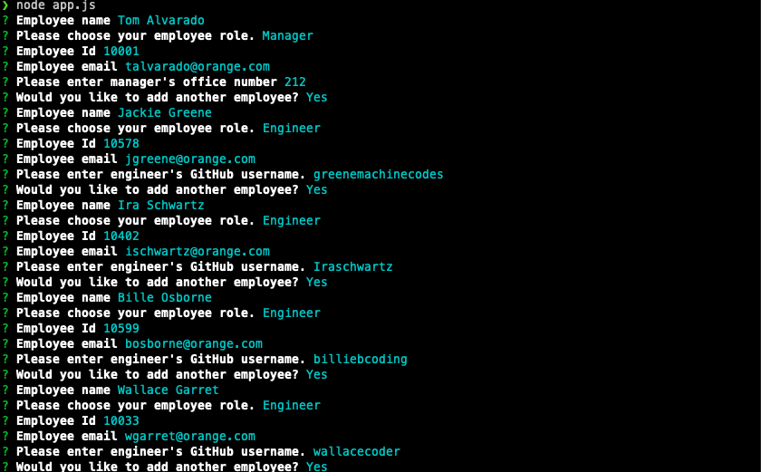
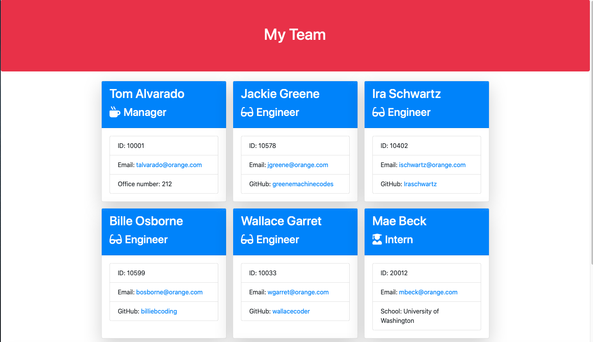

# Template Engine Employee Summary
    
  
  ---

  <a name="description"></a>
  ## Description
  A Node CLI that takes in information about employees and generates an HTML webpage that displays summaries for each person.

  ---
  ## Table of Contents
  
  1. [ Description ](#description)
  2. [ Visuals ](#visuals)
  3. [ Demo](#demo)
  4. [ Installation](#installation)
  5. [ Usage ](#usage)
  6. [ License ](#license)
  7. [ Contributing ](#contributing)
  8. [ Tests ](#tests)
  9. [ Questions ](#questions)

  ---

  ## Visuals

  
  

  

  ---

  ## Demo

  Checkout the [demo page](https://drive.google.com/file/d/1TaFboLfzeYsrF8nCS3sPrkENFLZncjjo/view) to see Template Engine Employee Summary in action.

  ---

  ## Installation

  
  Just run the following command at the root of your project:

  ```sh
  npm install
  ```
  ---

  ## Usage

  Just run the following command at the root of your project and answer questions:

  ```sh
  node app.js
  ```
  ---

  ## License

  Copyright (c) 2020, Andrew Crow. (MIT License)

  ---

  ## Contributing

  We are currently not allowing outside contributors to this project, but check back because things can change.

  ---

  ## Tests

  Just run the following command at the root of your project. 
  
  ```sh
  npm run test
  ```

  This will run the following 4 test suits for a total of 17 tests.

  - Engineer Test Suite
    - Can set GitHUb account via constructor (2ms)
    - getRole() should return "Engineer"
    - Can get GitHub username via getGithub() (1ms)
  - Employee.test.js
    - Can instantiate Employee instance
    - Can set name via constructor arguments (1ms)
    - Can set id via constructor argument
    - Can set email via constructor argument
    - Can get name via getName()
    - Can get id via getId()
    - Can get email via getEmail() (1ms)
    - getRole() should return "Employee"
  - Intern.test.js
    - Can set school via constructor
    - getRole() should return "Intern" (1ms)
    - Can get school via getSchool()
  - Manager.test.js
    - Can set office number via constructor argument
    - getRole() should return "Manager" (1ms)
    - Can get office number via getOffice()

  ---

  ## Questions

  If you have questions you can reach me here:
  
  Email: andrew@crow.me

  GitHub: [Github Profile](https://github.com/crowandrew)

  ---

